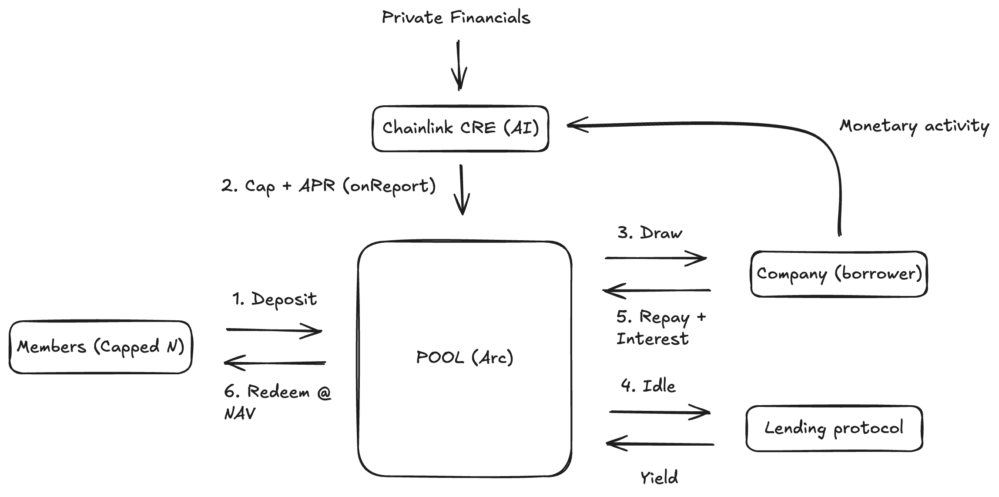

# Lattice

**A company's customers become its lenders.**

Lattice runs one USDC credit pool per company, settled on Arc. A capped set of that company's
customers deposit USDC and receive shares priced at the pool's net asset value. The pool lends to
the company against a credit line that Chainlink underwrites from its financials, the company pays
interest on what it borrows, and that interest returns to the pool and raises the value of every
share. If the company defaults, the pool writes down the unpaid principal and the shares lose value.

## Deployed contract (Arc testnet)

| | |
| --- | --- |
| Pool (`StakeAndAdvance`) | [`0x851E0D7A37E3b2b4823794dbc68341D6db7c6441`](https://testnet.arcscan.app/address/0x851E0D7A37E3b2b4823794dbc68341D6db7c6441) |
| USDC (ERC-20, 6 decimals) | [`0x3600000000000000000000000000000000000000`](https://testnet.arcscan.app/address/0x3600000000000000000000000000000000000000) |
| Borrower (company) | [`0xDb62c53403dD118f228ef3c015c41cFbE2c60846`](https://testnet.arcscan.app/address/0xDb62c53403dD118f228ef3c015c41cFbE2c60846) |
| Chainlink reporter / forwarder | [`0x19E95b026731974B7c1feD9eb3c3113fBDD80464`](https://testnet.arcscan.app/address/0x19E95b026731974B7c1feD9eb3c3113fBDD80464) |
| Chain | Arc testnet, chain ID `5042002` |
| RPC | `https://rpc.testnet.arc.network` |
| Explorer | `https://testnet.arcscan.app` |

**Live terms onchain:** Chainlink underwrote a 12,000 USDC credit line at 9.96% APR (996 bps).

Set these in `.env` for local dev:

- `STAKE_AND_ADVANCE_ADDRESS=0x851E0D7A37E3b2b4823794dbc68341D6db7c6441`
- `VITE_STAKE_AND_ADVANCE_ADDRESS=0x851E0D7A37E3b2b4823794dbc68341D6db7c6441`
- `COMPANY_ADDRESS=0xDb62c53403dD118f228ef3c015c41cFbE2c60846`

## How the money moves



1. Chainlink reads the company's private financials and onchain repayment record, then writes a credit cap and interest rate to the pool.
2. Members deposit USDC and receive shares at the current NAV. The pool caps how many members it admits.
3. The company draws against the cap, and the drawn amount becomes outstanding principal.
4. The pool lends idle cash to other protocols so the waiting balance earns a base yield.
5. The company repays principal and interest, the lending yield returns, and both raise NAV. A default lowers it.
6. Members redeem from the pool at NAV, for a profit if it rose or a loss on default.

Every transfer runs through the pool, so members and the company never move money to each other directly.

```
totalAssets = cash + outstanding principal
NAV / share = totalAssets / totalShares
```

Interest is cash-basis: unpaid accrued interest is tracked but only counts as a pool asset once paid,
so the pool can never owe more than it holds.

## Stack

| Piece | Role |
| --- | --- |
| **Arc** | USDC-native L1; gas and balances are both in USDC |
| **Chainlink Confidential AI (CRE)** | prices the cap and APR from private financials, delivers terms onchain via `onReport` |
| **Dynamic** | embedded wallets; customers join with an email through the `depositFor` seam |
| **Unlink** | seam for private member positions (not yet wired) |
| **Contract** | NAV shares, liquidity reserve, cash-basis interest, permissionless default |

Frontend: Vite + React + viem + Tailwind. Backend: Node HTTP server. Contracts: Solidity + Foundry.

## Run it

```bash
npm install
npm run dev            # frontend on :5173 (reads the live Arc pool)
npm run server         # backend API on :8788 (needs .env)

npm run build          # forge build --root contracts
npm test               # Foundry suite (26 tests)
npm run e2e:local      # local Anvil lifecycle: deposit, interest, profit redeem, default, loss redeem
npm run deploy:arc     # deploy to Arc testnet using .env
```

## Backend API (`:8788`)

| Method | Path | Purpose |
| --- | --- | --- |
| `GET` | `/health` | server status, chain, contract, underwriting mode |
| `GET` | `/pool/state` | NAV, cash, debt, shares, cap, APR, due date, default flag |
| `POST` | `/cre/underwrite` | runs underwriting and submits `onReport(bytes,bytes)` onchain |

```bash
curl -X POST localhost:8788/cre/underwrite \
  -H 'content-type: application/json' \
  -d '{"vendor":"0xDb62c53403dD118f228ef3c015c41cFbE2c60846","currentDepositedPrincipalUsdc":250,"monthlyRecurringRevenueUsd":5000,"grossMarginBps":8000,"cashBalanceUsd":50000,"monthlyBurnUsd":20000,"delinquencyRateBps":100}'
```

## Layout

```
contracts/   Solidity pool + Foundry tests (StakeAndAdvance.sol)
cre/         Chainlink underwriting workflow + cap/APR model
server/      backend API (health, pool state, underwrite)
src/         React dashboard (Dynamic wallet, deposit/redeem/draw/repay/underwrite)
scripts/     local anvil + Arc deploy + e2e lifecycle
keeper/      permissionless markDefault caller
```

See `SLIDES.md` for the pitch and `VIDEO_SCRIPT.md` for the demo script.
